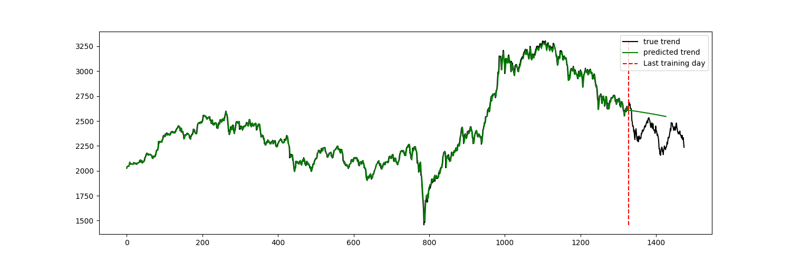
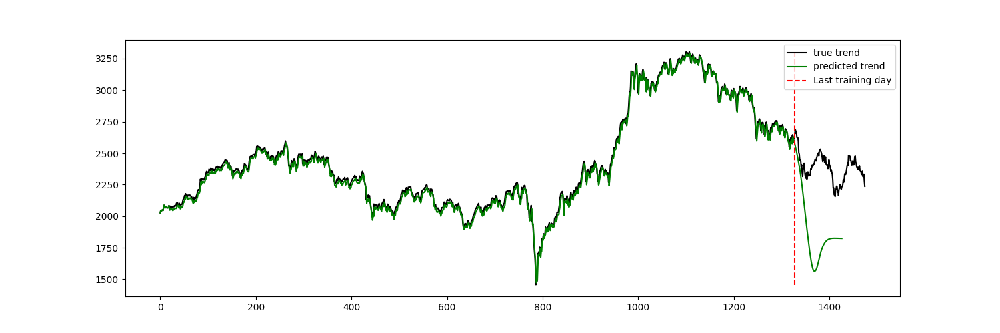

# Stock Price Prediction using Deep Learning models

This project aims to predict the stock price trends using two types of neural network models: LSTM and Transformer. Both models are implemented in PyTorch and the main script allows you to train and test either of them on a stock price dataset.

## Requirements
- PyTorch
- tqdm
- numpy
- pandas
- matplotlib
- scikit-learn

```
$ pip install -r requirements.txt
```

## Usage

To run the script, navigate to the project directory and type the following command:

```
python main.py <model_type> --data_path=<data_path> --epochs=<epochs> --batch_size=<batch_size> --hidden_dim=<hidden_dim> --learning_rate=<learning_rate> --seq_len=<seq_len> --future_day=<future_day> --num_layers=<num_layers> --dropout=<dropout> --nhead=<nhead>
```


Where:

- `<model_type>`: Type of the model to use for training. Choose between 'lstm' and 'transformer'.
- `<data_path>`: Path to the CSV file containing the stock price data. Default is 'dataset/pp_kospi.csv'.
- `<epochs>`: Number of training epochs. Default is 50.
- `<batch_size>`: Batch size for training. Default is 32.
- `<hidden_dim>`: Dimension of the hidden state in the LSTM/Transformer model. Default is 64.
- `<learning_rate>`: Learning rate for the optimizer. Default is 0.001.
- `<seq_len>`: Length of the sequence considered for prediction. Default is 20.
- `<future_day>`: Number of days to forecast in the future. Default is 100.
- `<num_layers>`: Number of recurrent layers. Default is 2.
- `<dropout>`: Dropout probability. Default is 0.5.
- `<nhead>`: The number of heads in the multiheadattention models. Default is 8.

For example, to train and evaluate an LSTM model with the default parameters, use:

```
python main.py lstm
```

## Modules
- `dataloader.py`: Contains functions for data loading and preprocessing.
- `util.py`: Contains utility functions.
- `main.py`: Main script for model training and evaluation.
- `model/`: Contains model definitions for LSTM and Transformer.

## Results

Here are some prediction results from the LSTM and Transformer models:

### LSTM Model Results



### Transformer Model Results



## References
https://github.com/huseinzol05/Stock-Prediction-Models