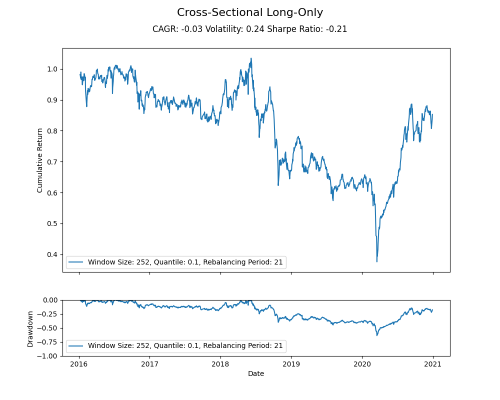
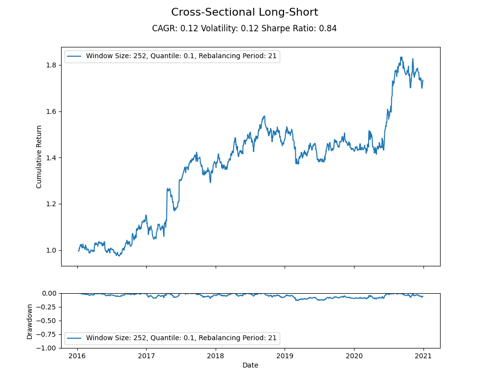
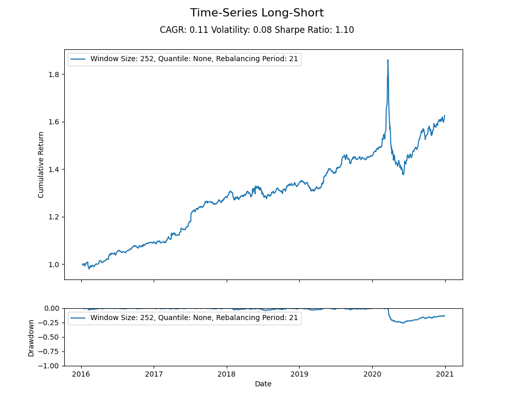

# Stock Momentum Strategies
This repository contains the implementation of two momentum-based trading strategies, cross-sectional momentum and time-series momentum, applied to historical stock price data. The performance of each strategy is visualized using four figures: "Cross-Sectional Long Only", "Cross-Sectional Long-Short", "Time-Series Long Only", and "Time-Series Long-Short".

## Getting Started
### Prerequisites
Make sure you have the following Python packages installed:

pandas
numpy
matplotlib
You can install them using pip:

```bash
pip install pandas numpy matplotlib
```
## Usage
1. Prepare the historical stock price data in a CSV or JSON file with datetime as the index and stock tickers as columns. Each cell contains the closing price of the respective stock on the respective date.
2. Run the main script with the desired arguments:

```bash
python main.py --input_file path/to/your/input_file --momentum_type cross_sectional --window_size 252 --quantile 0.1
```
The following arguments are available:

`--input_file`: Path to the input file containing historical stock price data.

`--momentum_type`: Choose between 'cross_sectional' and 'time_series' momentum strategies.

`--window_size`: Lookback window size for momentum calculation (default: 252).

`--quantile`: Quantile for the cross-sectional strategy (default: 0.1). This argument is only applicable for the cross-sectional momentum strategy.

The script will:
* Load the historical stock price data into a pandas DataFrame.
* Call the appropriate momentum strategy function (cross_sectional_momentum or time_series_momentum) with the DataFrame to obtain returns for the long-only and long-short strategies.
* Calculate performance metrics (CAGR, volatility, and Sharpe ratio) for each strategy using the performance_metrics function.
* Plot the cumulative returns and drawdowns of each strategy using the plot_cumulative_return_and_drawdown function.

## Strategy Overview
### Cross-Sectional Momentum
Compares the relative performance of different stocks within a specific period.
Ranks stocks based on their past returns over a certain lookback period.
Takes long positions in the top-performing stocks (e.g., top decile or quartile) and short positions in the bottom-performing stocks (e.g., bottom decile or quartile).
Aims to profit from the outperformance of the top-performing stocks compared to the bottom-performing ones.
### Time-Series Momentum
Focuses on the historical price trend of a single stock.
Evaluates a stock's performance based on its own past returns over a certain lookback period.
Takes a long position when the historical price trend is positive (e.g., when the moving average of past returns is positive) and a short position when the historical price trend is negative.
Aims to profit from the continuation of a stock's own price trend.

## Figures

The repository generates four figures to visualize the performance of each strategy:

1. **Cross-Sectional Long Only**: Shows the cumulative return and drawdown of the long-only cross-sectional momentum strategy.



2. **Cross-Sectional Long-Short**: Shows the cumulative return and drawdown of the long-short cross-sectional momentum strategy.



3. **Time-Series Long Only**: Shows the cumulative return and drawdown of the long-only time-series momentum strategy.


4. **Time-Series Long-Short**: Shows the cumulative return and drawdown of the long-short time-series momentum strategy.

