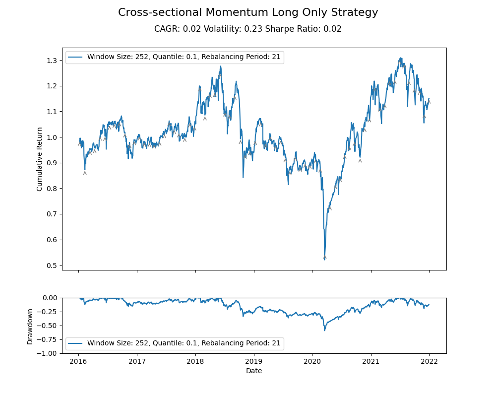
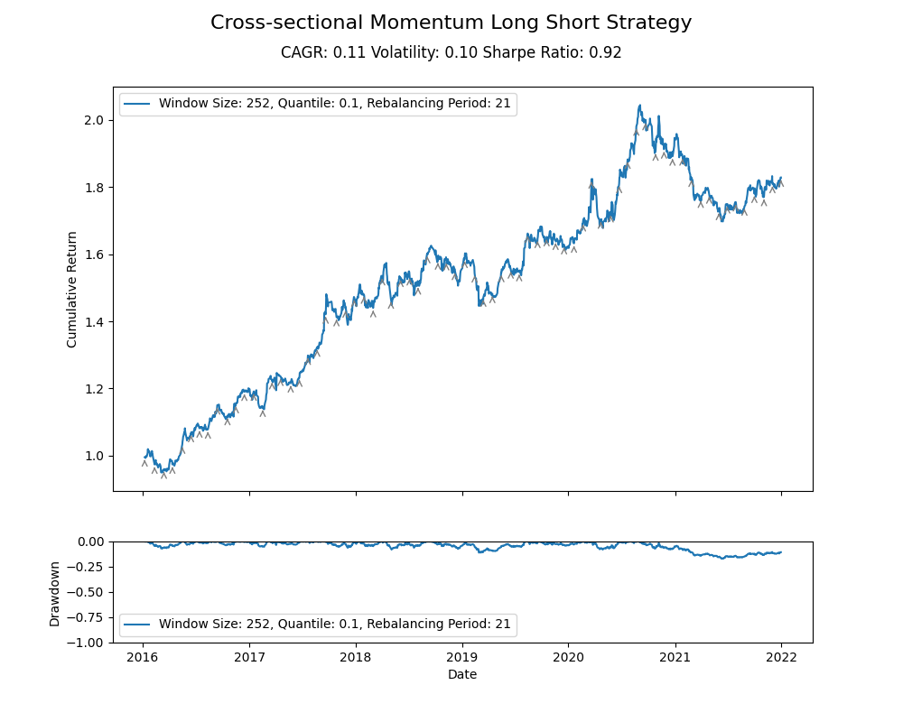
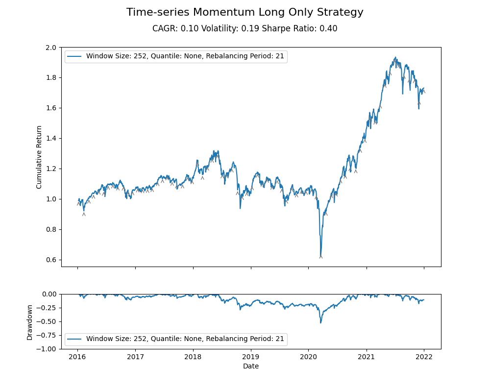
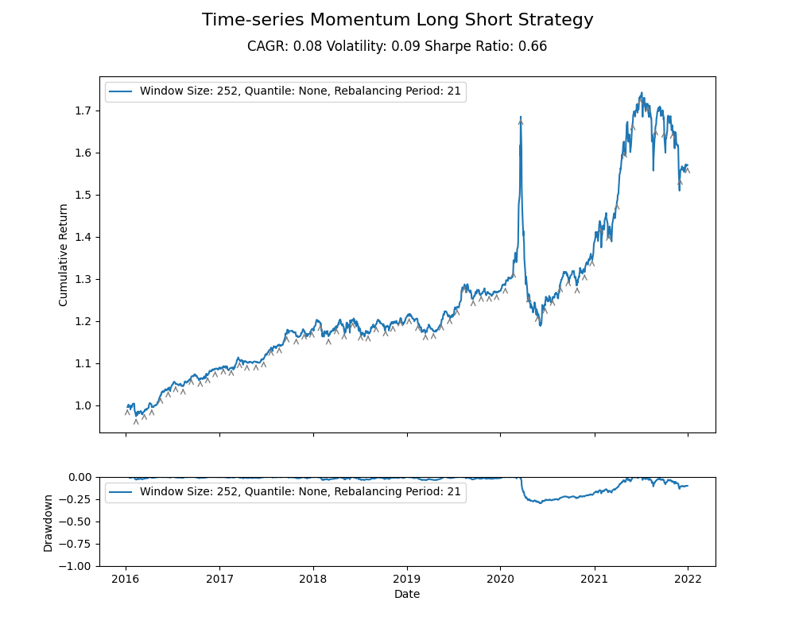
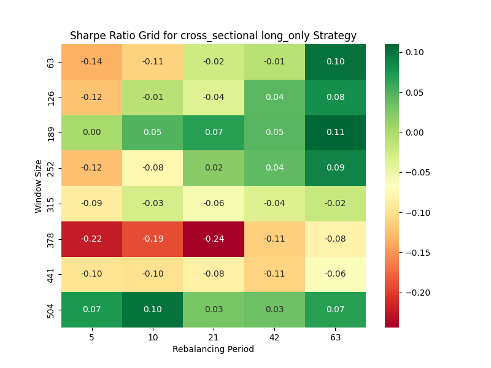
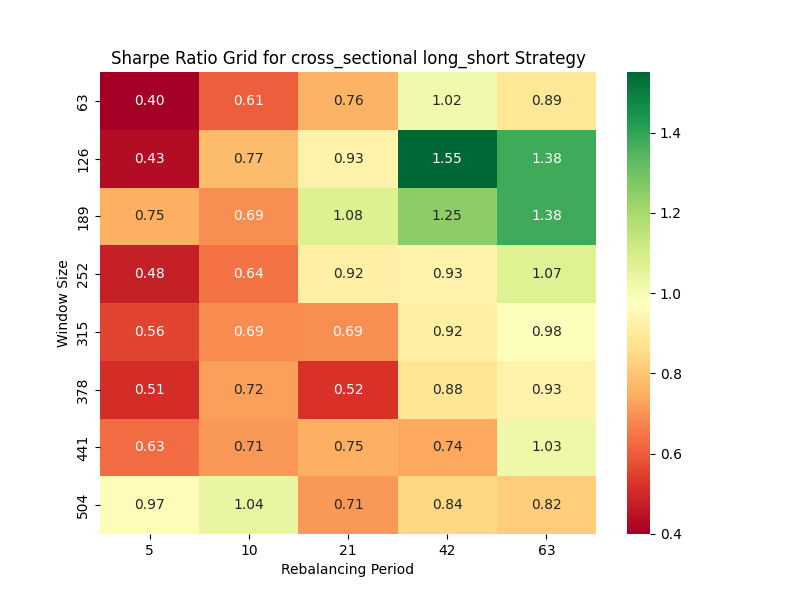
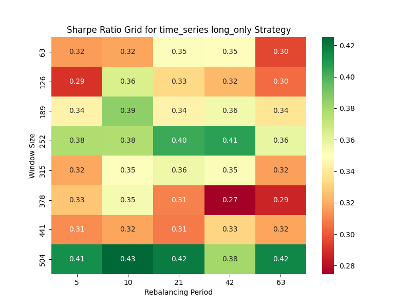
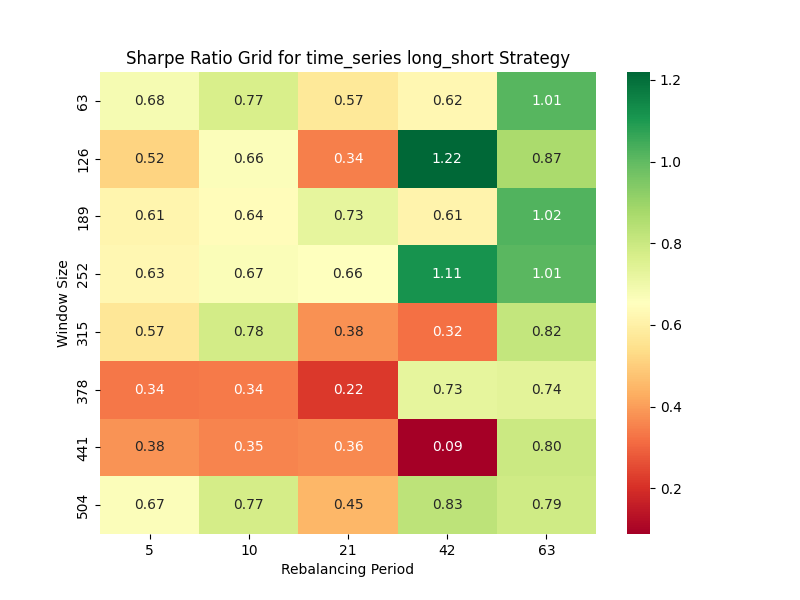

# Momentum Trading Strategies

This repository contains code for two momentum-based trading strategies: cross-sectional momentum and time-series momentum. The strategies are implemented using Python and rely on the `pandas` library for data manipulation and `matplotlib` and `seaborn` for data visualization.

## Installation

To use the code in this repository, clone the repository onto your local machine and install the required packages by running:

```
pip install numpy pandas matplotlib seaborn
```

## Data

The strategies use daily stock price data from FBA Quant FAI Session, which can be preprocessed using the `preprocess.py` script. You need to have a `data` directory that save CSV files of the stock ohlcv, number of shares, volume and tradability data for each symbol.

To preprocess the data, run:

```
python preprocess.py
```
This will generate a `clean_ohlcv.csv` file in the `root` directory.

## Cross-sectional Momentum Strategy

The cross-sectional momentum strategy ranks a universe of stocks based on their past returns and selects a long or short portfolio of the top and bottom performers, respectively. The code for the strategy is in the `momentum.py` and `backtest.py` modules. 

`momentum.py` implements the signal generation and portfolio construction logic, while `backtest.py` implements the logic for calculating the cumulative return and drawdown of the strategy.

To run the strategy with default parameters, run:

```
python main.py
```

This will generate plots of the cumulative return and drawdown for both a long-only and a long-short version of the strategy.

### Command-line Arguments

The `main.py` script accepts several command-line arguments:

- `--window_size`: the size of the rolling window used to calculate returns (default=252)
- `--quantile`: the quantile used to select the top and bottom performing stocks (default=0.1)
- `--rebalancing_period`: the number of trading days between portfolio rebalancing (default=21)
- `--strategy_type`: the type of strategy to run (`long_only` or `long_short`; default=`long_only`)

For example, to run the strategy with a window size of 126, a quantile of 0.05, and a rebalancing period of 42 trading days, run:

```
python momentum.py --window_size 126 --quantile 0.05 --rebalancing_period 42
```

## Time-series Momentum Strategy

The time-series momentum strategy selects a long or short portfolio of stocks based on their recent past performance relative to their own history. The code for the strategy is also in the `momentum.py` and `backtest.py` modules. 

To run the strategy with default parameters, run:

```
python main.py --momentum_type time_series
```

This will generate plots of the cumulative return and drawdown for both a long-only and a long-short version of the strategy.

You can get figures of the cumulative return and drawdown for the time-series momentum strategy like these:




Gray arrows indicate the start of a new rebalancing period.

### Command-line Arguments

The `momentum.py` script also accepts several command-line arguments for the time-series momentum strategy:

- `--window_size`: the size of the rolling window used to calculate returns (default=252)
- `--rebalancing_period`: the number of trading days between portfolio rebalancing (default=21)
- `--strategy_type`: the type of strategy to run (`long_only` or `long_short`; default=`long_only`)

For example, to run the time-series momentum strategy with a window size of 189 and a rebalancing period of 10 trading days, run:

```
python momentum.py --momentum_type time_series --window_size 189 --rebalancing_period 10
```

You can get figures of the cumulative return and drawdown for the time-series momentum strategy like these:




Gray arrows indicate the start of a new rebalancing period.

## Parameter Optimization

The `find_best_parameters.py` script can be used to find the optimal parameters for the momentum-based trading strategies. The script accepts several command-line arguments:

- `--trade_type`: The type of trading strategy to backtest. Available options are "long_only" and "long_short". Default is "long_only".

- `--momentum_type`: The type of momentum strategy to use. Available options are "cross_sectional" and "time_series". Default is "cross_sectional".

- `--window_sizes`: A list of window sizes to test. The default is [63, 126, 189, 252, 315, 378, 441, 504].

- `--rebalancing_periods`: A list of rebalancing periods to test. The default is [5, 10, 21, 42, 63].

For example, to find the optimal parameters for the long-only cross-sectional momentum strategy, run:

```
python optimize.py --trade_type long_only --momentum_type cross_sectional
```

This will generate a plot of the grid search results:

 | 
:-------------------------:|:-------------------------:
 | 